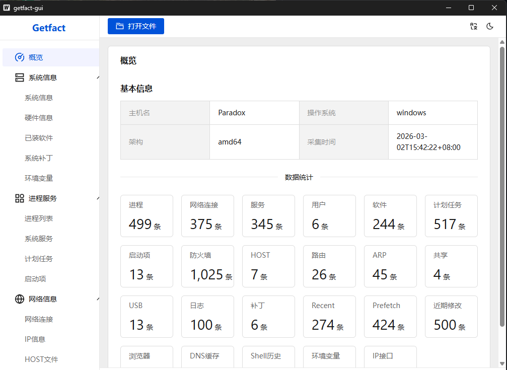
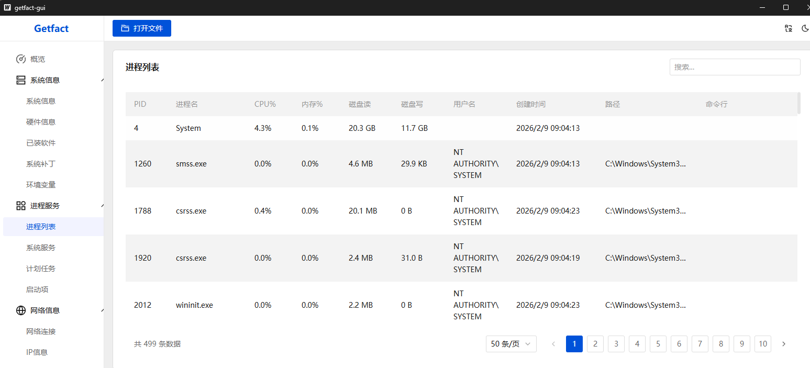
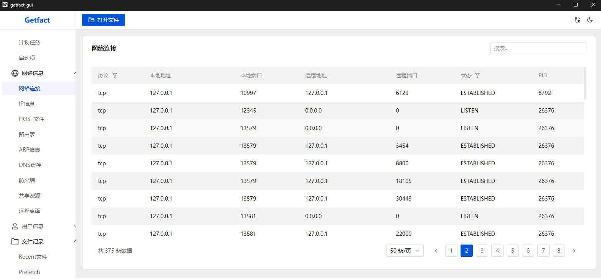
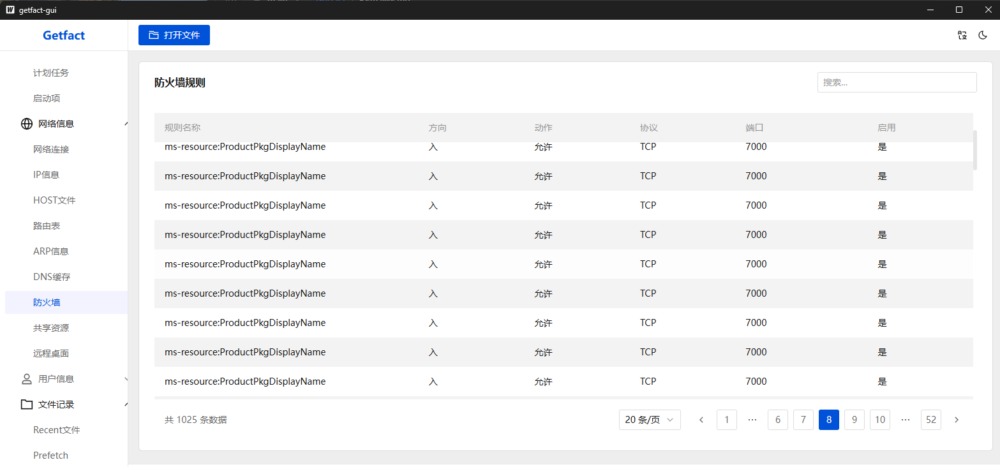
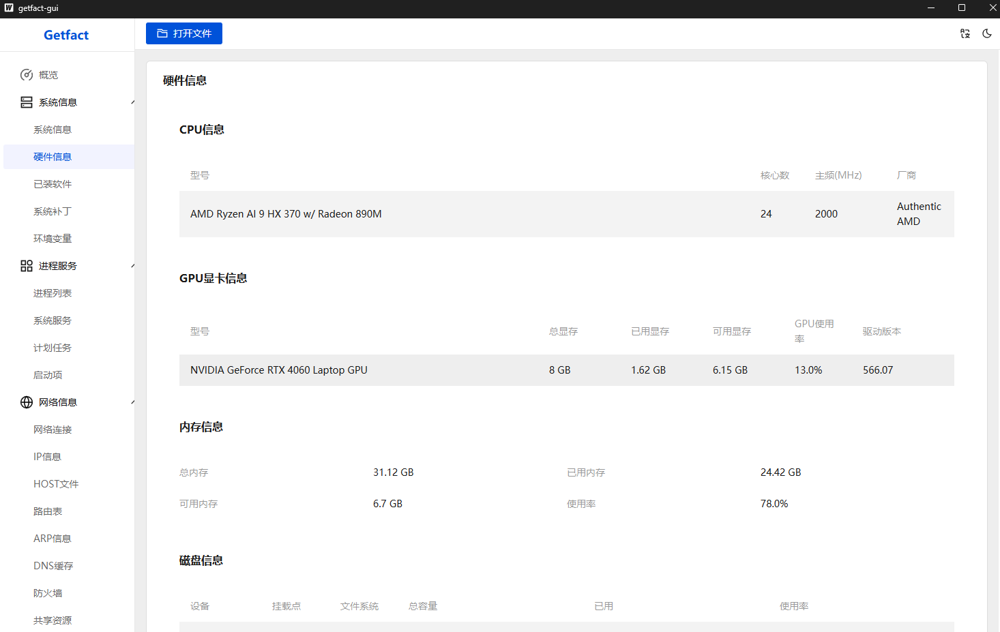
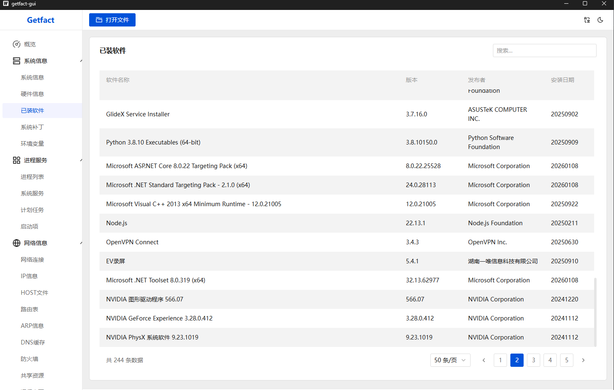
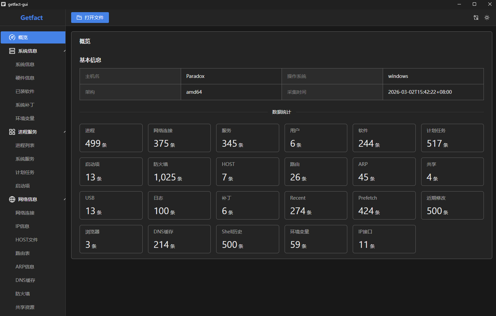
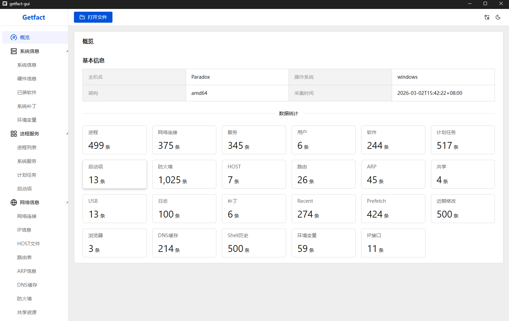
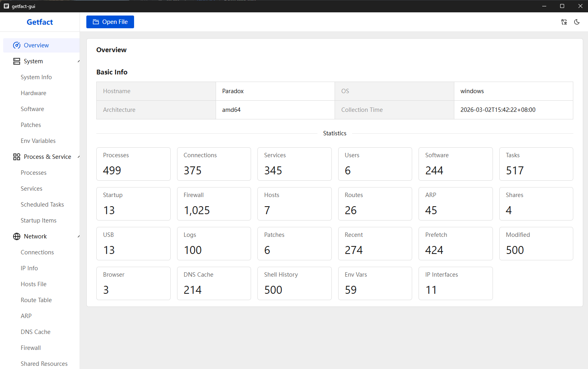

<div align="center">

# Getfact

[](GITHUB_README_EN.md)
[](GITHUB_README.md)

**跨平台自动化安全应急响应数据采集与分析工具**


一键采集目标主机 27 项关键安全数据，加密输出报告，GUI 可视化分析
专为**网络安全应急响应**、**入侵排查**、**挖矿病毒溯源**场景设计

[下载 Release](#-下载) · [快速开始](#-快速开始) · [功能特性](#-功能特性) · [截图预览](#-截图预览)

</div>

---

## 为什么选择 Getfact？

| 痛点 | Getfact 的解决方案 |
|------|-------------------|
| 手动排查耗时数小时 | **一键采集 27 项数据**，2 分钟完成 |
| 各平台命令不同 | **跨平台统一**，Windows/Linux/macOS/麒麟 |
| 采集数据散乱 | **结构化 JSON 报告**，加密存储 |
| 命令行输出难以分析 | **GUI 可视化界面**，搜索/排序/分页 |
| 中英文环境切换 | **中英双语支持**，一键切换 |

---

## 🚀 快速开始

### 三步完成应急排查

```
步骤 1                    步骤 2                     步骤 3
┌─────────────┐          ┌──────────────┐          ┌──────────────┐
│  目标主机    │  JSON    │   分析主机    │          │   查看数据    │
│  运行 Agent  │ ──────>  │  运行 GUI     │ ──────>  │  搜索/筛选    │
│  agent.exe   │  (加密)  │  getfact-gui  │          │  排查威胁     │
└─────────────┘          └──────────────┘          └──────────────┘
```

**在目标主机运行 Agent：**
```bash
# Windows（建议以管理员身份运行）
agent.exe

# Linux / 麒麟
sudo ./agent_linux_amd64

# macOS
sudo ./agent_darwin_arm64
```

**在分析主机运行 GUI：**
```bash
getfact-gui.exe
# 点击「打开文件」→ 加载 Agent 生成的加密报告 → 开始分析
```

---

## 📦 下载

从 [Releases](../../releases) 页面下载对应平台的可执行文件：

### Agent（部署到目标主机）

| 平台 | 文件名 | 架构 |
|------|--------|------|
| Windows | `agent.exe` | x86-64 |
| Linux | `agent_linux_amd64` | x86-64 |
| Linux / 麒麟 | `agent_linux_arm64` | ARM64 |
| macOS (Intel) | `agent_darwin_amd64` | x86-64 |
| macOS (Apple Silicon) | `agent_darwin_arm64` | ARM64 |

### GUI 分析端

| 平台 | 文件名 | 说明 |
|------|--------|------|
| Windows | `getfact-gui.exe` | 需要 WebView2 运行时 |

> Agent 为单文件可执行程序，无需安装，无外部依赖，拷贝即用。

---

## ✨ 功能特性

### 27 项数据采集

<table>
<tr>
<td width="25%">

**🖥️ 系统信息**
- 系统信息
- 硬件信息（CPU/内存/磁盘/GPU）
- 已装软件
- 系统补丁
- 环境变量

</td>
<td width="25%">

**⚙️ 进程与服务**

- 进程列表（含 CPU%/内存%）
- 系统服务
- 计划任务
- 启动项

</td>
<td width="25%">

**🌐 网络信息**
- 网络连接
- IP 信息
- HOST 文件
- 路由表
- ARP 缓存
- DNS 缓存
- 防火墙规则
- 共享资源
- 远程桌面

</td>
<td width="25%">

**🔍 取证信息**
- 用户信息（含 SID）
- Shell 命令历史
- 剪切板内容
- Recent 文件
- Prefetch 文件
- 近期修改文件
- 浏览器信息
- USB 设备记录
- 系统日志

</td>
</tr>
</table>

### GUI 分析功能

| 功能 | 说明 |
|------|------|
| **全局搜索** | 每个模块页面内置搜索框，支持按任意字段模糊搜索 |
| **智能排序** | 表格列头点击排序，日期列默认按最新优先 |
| **分页浏览** | 支持 20/50/100/200 条每页，适配大数据量 |
| **数据加密** | Agent 输出 AES-256-GCM 加密文件，GUI 自动解密 |
| **黑白主题** | 支持 Dark / Light 主题切换，偏好自动保存 |
| **中英双语** | 一键切换中文 / English 界面 |
| **进程资源** | 进程列表显示 CPU%、内存%、磁盘 IO |
| **GPU 信息** | 显卡型号、显存、使用率、驱动版本 |

### 安全特性

| 特性 | 说明 |
|------|------|
| **纯本地运行** | Agent 无网络通信，所有数据本地采集 |
| **AES-256-GCM 加密** | 采集报告加密存储，防止数据泄露 |
| **单文件部署** | 无需安装，不写注册表，不留驻后台 |
| **兼容未加密** | GUI 同时支持加密和未加密的历史报告 |

---

## 📸 截图预览

### 概览页面

> 加载报告后，一览全部 27 个模块的数据统计



### 进程列表

> 显示进程名、PID、CPU%、内存%、磁盘 IO，支持搜索和排序



### 网络连接

> TCP/UDP 连接详情，支持按协议筛选、按端口排序



### 防火墙规则

> 完整防火墙规则列表，支持搜索规则名称



### 硬件信息

> CPU、GPU、内存、磁盘信息一览



### 已装软件

> 按安装日期倒序排列，快速搜索定位可疑软件



### 主题切换

> 支持 Dark / Light 双主题

| Dark 主题 | Light 主题 |
|-----------|------------|
|  |  |

### 语言切换

> 支持中文 / English 双语言，一键切换界面语言



---

## 📂 输出说明

### 文件位置

| 平台 | 输出目录 | 文件名格式 |
|------|---------|------------|
| Windows | `C:\Getfact\` | `{主机名}_{时间戳}.json` |
| Linux/macOS | `/tmp/Getfact/` | `{主机名}_{时间戳}.json` |

### 文件格式

Agent 输出的 `.json` 文件经 **AES-256-GCM** 加密，直接打开显示为二进制乱码。使用 `getfact-gui.exe` 可自动解密并可视化展示。

```
加密前 (JSON)                    加密后 (二进制)
┌──────────────────────┐        ┌──────────────────────┐
│ {                    │  AES   │ ¥Þ¶×ŒÑ...           │
│   "version": "1.1",  │ ────>  │ (不可直接阅读)        │
│   "modules": {...}   │  GCM   │                      │
│ }                    │        │                      │
└──────────────────────┘        └──────────────────────┘
```

---

## ⚙️ 系统要求

### Agent

| 平台 | 最低要求 | 建议 |
|------|---------|------|
| Windows | Windows 7+ | Windows 10/11，管理员权限 |
| Linux | glibc 2.17+（CentOS 7+） | root 权限获取完整数据 |
| macOS | macOS 10.12+ | root 权限获取完整数据 |
| 麒麟 | Kylin V10 ARM64 | root 权限 |

### GUI

- Windows 10 及以上
- WebView2 运行时（首次运行自动提示安装）

---

## 🔐 权限说明

部分模块需要**管理员/root 权限**才能获取完整数据：

| 模块 | 普通用户 | 管理员/root |
|------|---------|------------|
| 进程列表 | 基本信息 | + 完整命令行 + 其他用户进程 |
| 网络连接 | 连接信息 | + 关联进程 PID |
| 防火墙 | ✅ (Windows) | ✅ (Linux/macOS 需 root) |
| Prefetch | ❌ 无权限 | ✅ (仅 Windows) |
| 系统日志 | ✅ (Windows) | ✅ (Linux/macOS 需 root) |
| GPU 信息 | ✅ 基本信息 | ✅ (nvidia-smi 需在 PATH 中) |

**建议以管理员/root 身份运行 Agent 以获取最完整的数据。**

---

## 🏗️ 技术架构

```
┌─────────────────────────────────────────────────────────────┐
│                        Getfact                              │
├────────────────────────┬────────────────────────────────────┤
│                        │                                    │
│   Agent (Go)           │   GUI (Wails v2 + Vue 3)           │
│                        │                                    │
│   ┌────────────────┐   │   ┌──────────────────────────┐     │
│   │ 27 个采集器     │   │   │ 前端 (Vue 3 + TDesign)    │     │
│   │ 平台特定实现    │   │   │ • 27 个视图页面           │     │
│   │ _windows.go    │   │   │ • Pinia 状态管理          │     │
│   │ _linux.go      │   │   │ • vue-i18n 国际化         │     │
│   │ _darwin.go     │   │   │ • Dark/Light 主题         │     │
│   └───────┬────────┘   │   └──────────┬───────────────┘     │
│           ↓            │              ↑                     │
│   ┌────────────────┐   │   ┌──────────┴───────────────┐     │
│   │ AES-256-GCM    │   │   │ Go 后端                   │     │
│   │ 加密输出        │───┼──>│ AES-256-GCM 解密          │     │
│   │ .json 文件     │   │   │ JSON 解析                 │     │
│   └────────────────┘   │   └──────────────────────────┘     │
│                        │                                    │
└────────────────────────┴────────────────────────────────────┘
```

### 技术栈

| 组件 | 技术 |
|------|------|
| Agent | Go 1.21+, gopsutil v3 |
| GUI 后端 | Go + Wails v2 |
| GUI 前端 | Vue 3 + TDesign Vue Next + Pinia + vue-i18n |
| 加密 | AES-256-GCM (crypto/aes) |
| GPU 采集 | nvidia-smi / WMIC / lspci / system_profiler |

---

## 📊 性能参考

| 指标 | 数值 |
|------|------|
| Agent 采集时间 | 1-3 分钟 |
| Agent 体积 | ~5 MB（单文件） |
| GUI 体积 | ~12 MB（单文件） |
| 报告大小 | 5-100 MB（取决于系统） |
| 典型进程数 | 100-500+ |
| 典型防火墙规则 | 500-2000+ |
| 典型软件数 | 100-500+ |

---

## ❓ 常见问题

<details>
<summary><b>Q: Agent 采集需要联网吗？</b></summary>

不需要。Agent 纯本地运行，不发送任何网络请求，不连接外部服务器。
</details>

<details>
<summary><b>Q: 采集的 JSON 文件直接打开是乱码？</b></summary>

这是正常现象。从 v1.1.0 起，Agent 输出的报告使用 AES-256-GCM 加密。请使用 `getfact-gui.exe` 打开文件，GUI 会自动解密。
</details>

<details>
<summary><b>Q: Prefetch 模块显示无数据？</b></summary>

Prefetch 仅在 Windows 上可用，且需要管理员权限。请右键 Agent → 以管理员身份运行。
</details>

<details>
<summary><b>Q: Linux 上网络连接的 PID 显示为 0？</b></summary>

需要 root 权限。使用 `sudo ./agent_linux_amd64` 运行。
</details>

<details>
<summary><b>Q: GPU 信息只显示型号，没有使用率？</b></summary>

完整 GPU 数据（使用率、显存占用）需要 NVIDIA 驱动并安装 `nvidia-smi`。非 NVIDIA 显卡仅采集基本型号信息。
</details>

<details>
<summary><b>Q: 如何分析 Linux/macOS 主机的数据？</b></summary>

在目标主机运行 Agent → 将生成的 `.json` 文件传输到 Windows 主机 → 使用 GUI 打开分析。
</details>

---

## 🗺️ 路线图

- [ ] 异常行为自动检测（可疑进程、异常连接标红）
- [ ] HTML 报告导出
- [ ] Linux/macOS GUI 支持
- [ ] Agent 命令行参数（指定模块、输出目录）
- [ ] 多报告对比分析

---

## 📄 许可证

**Proprietary License** — 本软件为非开源软件，仅限授权使用。

未经书面授权，禁止复制、修改、分发本软件的任何部分。

---

## 致谢

本项目使用了以下开源组件：

- [gopsutil](https://github.com/shirou/gopsutil) — 跨平台系统信息采集
- [Wails](https://wails.io/) — Go 桌面应用框架
- [Vue 3](https://vuejs.org/) — 前端框架
- [TDesign](https://tdesign.tencent.com/) — 腾讯企业级 UI 组件库
- [Pinia](https://pinia.vuejs.org/) — Vue 状态管理
- [vue-i18n](https://vue-i18n.intlify.dev/) — 国际化

---

<div align="center">

**Getfact** — 让应急响应更快一步

</div>
